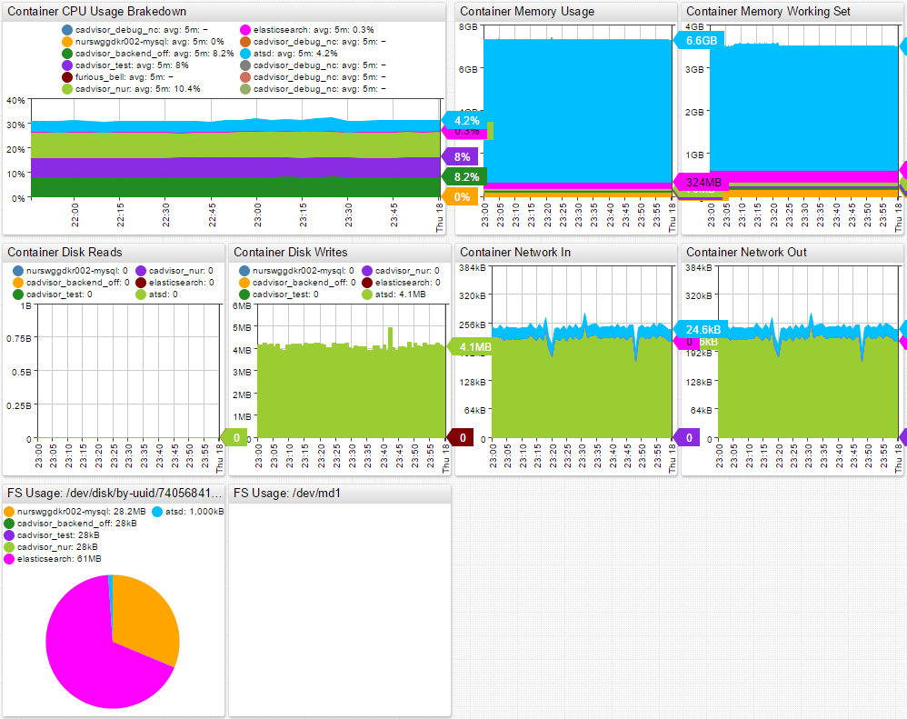

# Installing Axibase Time-Series Database (ATSD) as the backend for cAdvisor 

[Axibase Time Series Database](http://axibase.com/products/axibase-time-series-database/) can collect Docker metrics through cAdvisor for long-term retention, analytics and visualization. A single ATSD instance can collect metrics from many Docker hosts and cAdvisors.

Remote Docker hosts can be easily monitored with multiple cAdvisor instances sending data to a centralized ATSD server. ATSD will store metrics from local and remote Docker hosts for consolidated monitoring and analytics. This type of setup will allow for centralized capacity planning and performance monitoring.


#### Quick Start: Running cAdvisor in a Docker Container with ATSD as the storage driver

If ATSD is not already running, you can start it using:

```
docker run \
  -d \
  -p 8088:8088 \
  -p 8081:8081 \
  -p 8443:8443 \
  -p 8082:8082/udp \
  -e ATSD_USER_NAME=${ATSD_USER_NAME} \
  -e ATSD_USER_PASSWORD=${ATSD_USER_PASSWORD} \
  -h atsd \
  --name=atsd \
  axibase/atsd
```

${ATSD_USER_PASSWORD} - minimum password length is 6 characters.

Launch cAdvisor container with ATSD storage driver:

```
docker run \
  --volume=/:/rootfs:ro \
  --volume=/var/run:/var/run:rw \
  --volume=/sys:/sys:ro \
  --volume=/var/lib/docker/:/var/lib/docker:ro \
  --publish=8080:8080 \
  --detach=true \
  --name=cadvisor \
  --link atsd:atsd \
  google/cadvisor:latest \
  --storage_driver=atsd \
  --storage_driver_user=${ATSD_USER_NAME} \
  --storage_driver_password=${ATSD_USER_PASSWORD} \
  --storage_driver_atsd_url=http://atsd:8088 \
  --storage_driver_atsd_write_host=atsd:8081 \
  --storage_driver_atsd_write_protocol=tcp \
  --storage_driver_atsd_docker_host="`hostname`" \
  --storage_driver_atsd_property_interval=15s \
  --housekeeping_interval=15s \
  --storage_driver_buffer_duration=15s
```

Alternatively, you can specify these parameters in a toml configuration file:

```
docker run \
  --volume=/:/rootfs:ro \
  --volume=/var/run:/var/run:rw \
  --volume=/sys:/sys:ro \
  --volume=/var/lib/docker/:/var/lib/docker:ro \
  --volume=${HOME}:/root:ro \
  --publish=8080:8080 \
  --detach=true \
  --name=cadvisor \
  --link atsd:atsd \
  google/cadvisor:latest \
  --storage_driver=atsd \
  --storage_driver_user=${ATSD_USER_NAME} \
  --storage_driver_password=${ATSD_USER_PASSWORD} \
  --storage_driver_atsd_config_path="/root/cadvisor.toml"
```

```toml
url = "http://atsd:8088"        #ATSD server http/https endpoint
write_host     =  "atsd:8081"   #ATSD server TCP/UDP destination, formatted as host:port
write_protocol =  "tcp"         #transfer protocol. Possible settings: http, https, udp, tcp

connection_limit = 1            #ATSD storage driver TCP connection count
memstore_limit   = 1000000      #maximum number of series commands stored in buffer until flush


#Specify optional deduplication settings for a metric group.

#[deduplication.groupName] - Metric group to which the setting applies. Supported metric groups in cAdvisor: cpu, memory, io, network, task, filesystem
#interval - Maximum delay between the current and previously sent samples. If exceeded, the current sample is sent to ATSD regardless of the specified threshold.
#threshold - Absolute or percentage difference between the current and previously sent sample values. If the absolute difference is within the threshold and elapsed time is within Interval, the value is discarded.


#[deduplication]
#    [deduplication.cpu]
#    interval = "15s"
#    threshold = "3"
#
#    [deduplication.io]
#    interval = "15s"
#    threshold = "1%"
#
#    [deduplication.memory]
#    interval = "15s"
#    threshold = "1%"
#
#    [deduplication.network]
#    interval = "15s"
#    threshold = "1%"
#
#    [deduplication.task]
#    interval = "15s"
#    threshold = "1%"
#
#    [deduplication.filesystem]
#    interval = "15s"
#    threshold = "1%"

[cadvisor]
store_major_numbers  = false          #store statistics for devices with all available major numbers
store_user_cgroups   = false          #store statistics for "user" cgroups (for example: docker-host/user.*)
property_interval    = "1m"           #container property update interval. Should be >= housekeeping_interval
sampling_interval    = "1s"           #interval at which series data is sampled. By default set to housekeeping_interval. Should be >= housekeeping_interval.
docker_host          = "docker-01"    #hostname of the machine where docker daemon is running. By default set to 'docker-host'. Needs to be set manually because cadvisor container doesn't know hostname of the docker machine.
```

#### More Options:

flag                                     | default value              | description
-----------------------------------------|----------------------------|------------
storage_driver_buffer_duration           |1m                          | time for which data is accumulating in a buffer before send
storage_driver_atsd_url                  |""                          | atsd http/https endpoint
storage_driver_atsd_write_host           |""                          | tcp/udp destination host:port
storage_driver_atsd_write_protocol       |"http/https"                | write protocol. Possible settings: http/https, udp, tcp
storage_driver_atsd_store_major_numbers  |false                       | include statistics for devices with all available major numbers
storage_driver_atsd_property_interval    |1m                          | container property update interval. Should be >= housekeeping_interval
storage_driver_atsd_sampling_interval    |housekeeping_interval value | series sampling interval. Should be >= housekeeping_interval
storage_driver_atsd_docker_host          |"docker-host"               | hostname of the docker machine (entity prefix)
storage_driver_atsd_store_user_cgroups   |false                       | include statistics for "user" cgroups 
storage_driver_atsd_buffer_limit         |1000000                     | max series commands to store in buffer until flush
storage_driver_atsd_connection_limit     |1                           | tcp connection count
storage_driver_atsd_config_path          |""                          | path to ATSD storage driver config file

You can view the collected metrics under the Entity and Metrics tabs in ATSD.
*Note that disk metrics are only collected from containers that have attached volumes.*

#### Built-in Portals:

#### Container Overview Portal


#### Container Disk Detail Portal


#### Docker Host Portal


#### Docker Mutli-Host Portal

